# Secret Sauce Sales consulting
(Developer: Daniel O'Reilly)

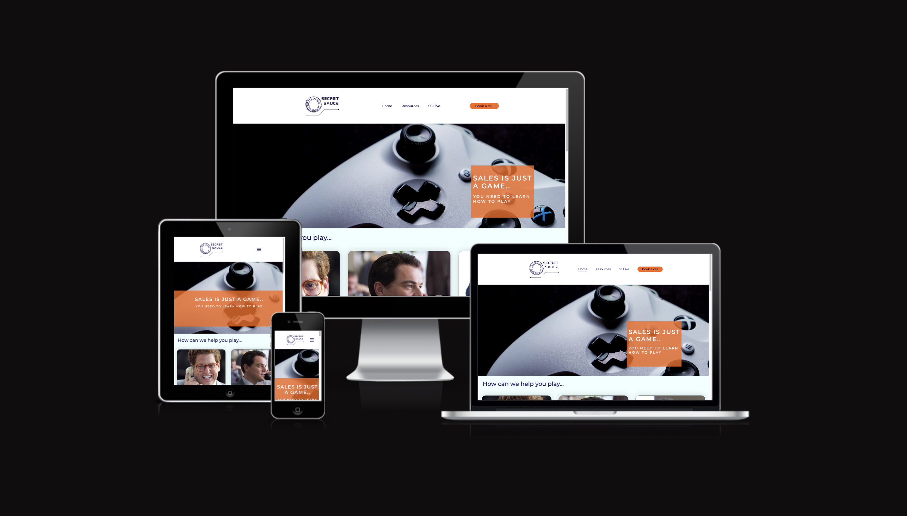

[Live webpage](https://doreilly2022.github.io/CI_PP1_SECRETSAUCE/)

## Table of Content

1. [Project Goals](#project-goals)
    1. [User Goals](#user-goals)
    2. [Site Owner Goals](#site-owner-goals)
2. [User Experience](#user-experience)
    1. [Target Audience](#target-audience)
    2. [User Requrements and Expectations](#user-requrements-and-expectations)
    3. [User Stories](#user-stories)
3. [Design](#design)
    1. [Design Choices](#design-choices)
    2. [Colour](#colours)
    3. [Fonts](#fonts)
    4. [Structure](#structure)
4. [Technologies Used](#technologies-used)
    1. [Languages](#languages)
    2. [Frameworks & Tools](#frameworks-&-tools)
5. [Features](#features)
6. [Testing](#validation)
    1. [HTML Validation](#HTML-validation)
    2. [CSS Validation](#CSS-validation)
    3. [Accessibility](#accessibility)
    4. [Performance](#performance)
    5. [Device testing](#performing-tests-on-various-devices)
    6. [Browser compatibility](#browser-compatability)
    7. [Testing user stories](#testing-user-stories)
8. [Bugs](#Bugs)
9. [Deployment](#deployment)
10. [Credits](#credits)
11. [Acknowledgements](#acknowledgements)

## Project Goals 

### User Goals 
- To find a sales coach that will help them improve their close rate and elevate their career.
- To find resources to help validate their search for the best sales coach. 
- To book in a call to discuss sales coaching. 

### Site Owner Goals
- To solidify their presence as a thought leader in the sales coaching market. 
- To get prospects to book in a call for consulation. 
- To promote upcoming events and conferences. 

## User Experience

###Target Audience
- Tech sales professionals across UKI. 
- Technology companies that outsource their coaching. 
- Wider industry sales professionals that are trying to upskill and progress their career. 

### User Requirements and Expectations

- A simple clean and modern layout
- A simple navigation on mobile and desktop. 
- Obvious call to action to get users to book a call. 
- Well laid out resource section. 
- Overall responsive for Desktop and mobile. 
- Accessibility

### User Stories

### First-time User

1. First time users should clearly be able to book a call from all pages. 
2. First time users should clearly be able to find resources to help their career. 
3. First time users should clearly be able to find information on the upcoming event. 
4. First time users should clearly be able to find the location of the offices. 

### Returning Users

1. Returning users should clearly be able to find the contact/book a call page. 
2. Returning users should clearly be able to find the resources page. 
3. Returning users should clearly be able to see the upcoming event page. 

### Site owner

1. The site owner wants users to be able to book a call asap. 
2. The site owner wants to be able to push users to the event booking page. 
3. The site owner wants a clean and professional website that matches the style of the brand. 

## Design

### Design Choices
The website was designed to give a clean and professional look and feel to the user. The website looks modern while echoing the brands colors. 

### Colour
The colour scheme echos the colours of the brand, using the same dark blue/navy from their logo. I tested the color choices on WebAIM to ensure they passed the contrast test. 

[Color pallette](docs/color_pallete.png)

### Fonts
Montserrat was used for the headings and lato was used for the body. 

### Structure
The website is designed in a simple and responsive manner. The nav bar is displayed in a traditional way with logo to left and nav links to the right. On mobile the nav bar turns to a burger bar and pops out from the side upon click. 
The website has 4 pages:
1. A home page with info on the business and a CTA to book a call. 
2. A resources page with blog info and a CTA to book a call. 
3. An event page with info on the event with 2 CTAs, one to book a ticket, the other to book a call. 
4. A contact page with a book a call form and a map as well as business information. 

## Technologies Used

### Languages
- HTML 
- CSS
- Javascript

### Frameworks and Tools 
- Git
- GitHub
- Googlefonts
- Font Awsome
- Facicon.io 
- Canva

## Features
The website consists of four pages and eleven features

### Logo and Navigation Bar 
- Present on all pages.
- The Nav bar is resposive and transforms to a hamburger menu on smaller screens
- The Nav menu clearly shows the current page. 

### Hero Image
- Adds a stylish into to the user. 
- Responsive text provokes the user with a message regarding sales. 

### Information Cards 
- Gives the user information about the changing landscape in sales. 
- Responsive sections with images makes the experience pleasant for the user. 
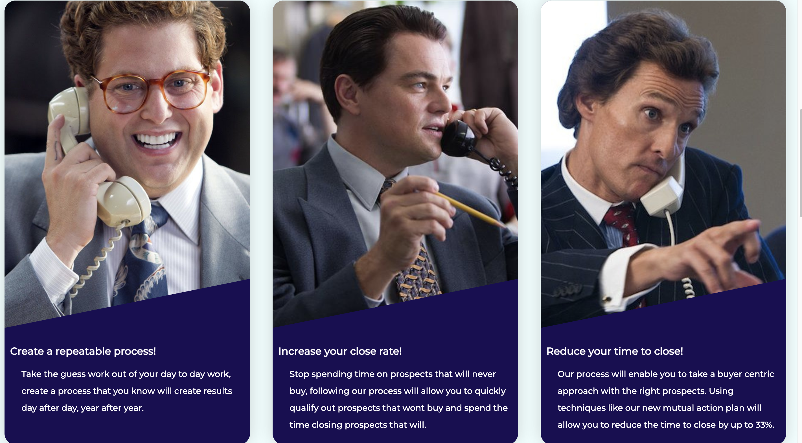

### CTA
- Featured on three pages: Home, Resources and SS Live. 
- Brings the users focus to a primary goal of the website - Booking calls. 
- Responsive on mobile. 
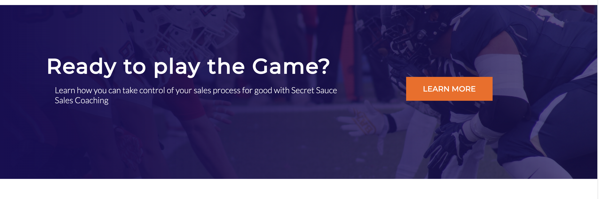

### Footer 
- Featured on all four pages. 
- Three sections : Pages Nav, Address, Newsletter signup. 
- Responsive sections for better mobile experience. 
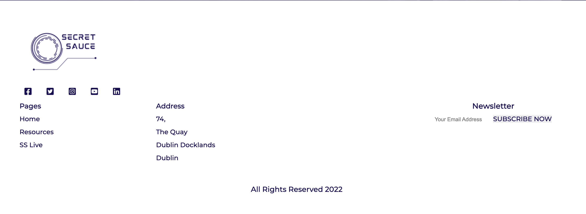

### Resources Section 
- Allows users to access and download resources. 
- Content is laid out well and responsive. 
- Mock content automatically downloads in browser. 

### Video Section
- Showcases upcoming event to users. 

### Speakers Section
- Showcases Speakers for event to users. 
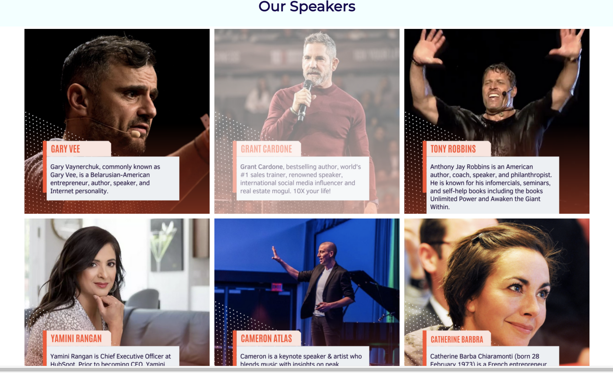

### CTA for ticket booking 
- Pushes users to eventbrite to buy tickets. 
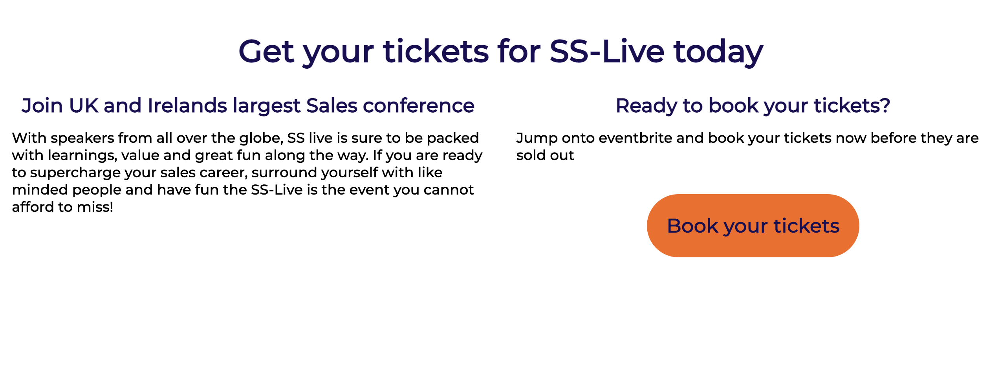

### Contact form 
- Allows users to book a call with the team. 

### Embedded Map
- Allows users to see where the business is located and adds to professionalism of the business. 
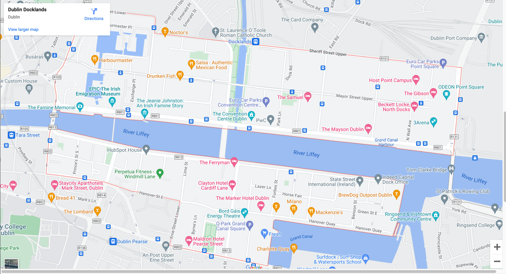

## Validation 

### HTML Validation 
Used W3C Validation to enure the html of the website was valid. All pages passed. 
    

Home

    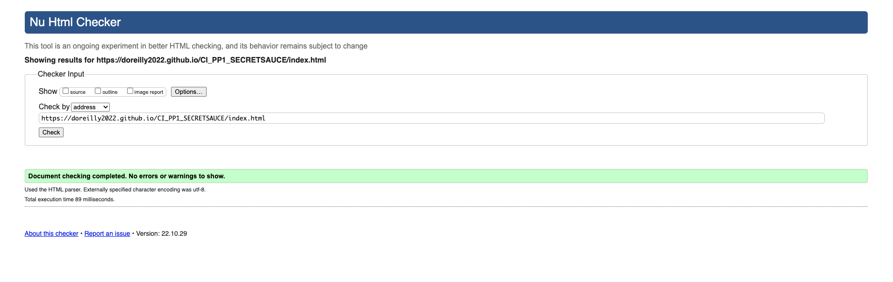
    

    

Resources

    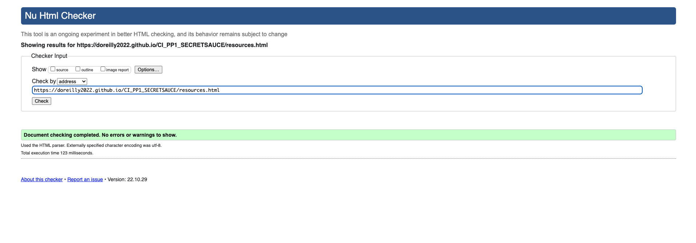
    

    

SS-Live

    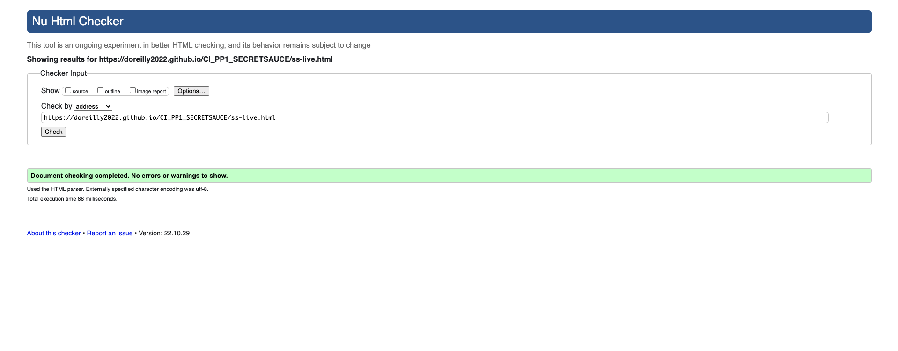
    

    

Book a Call

    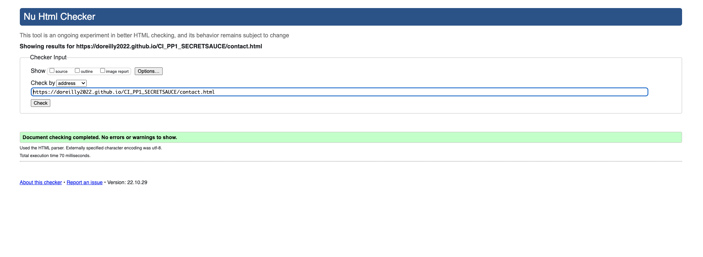
    

        
### CSS Validation
Used W3C Jigsaw to ensure the css of the website was valid. The code passed. 
    

CSS

    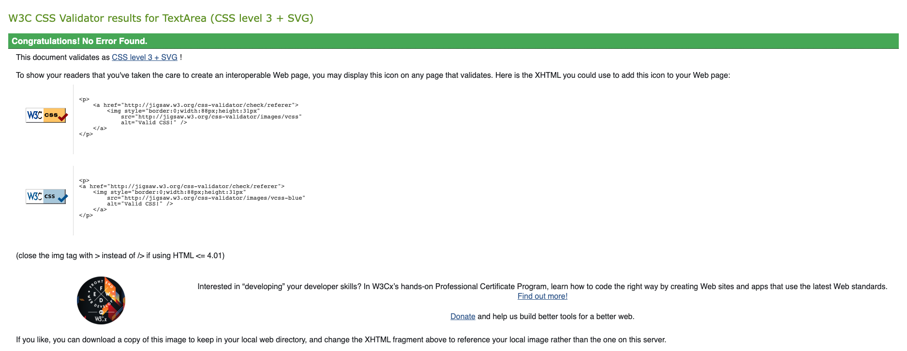
    

### Accessibility
 Used Wave to ensure the website was highly accessible and met standards. All pages passed with 0 errors and 0 contrast errors. 
    

Home

    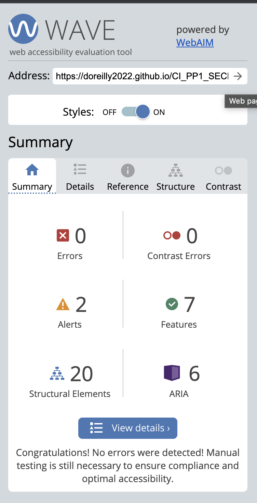
    

    

Resources

    
    

    

SS-Live

    
    

    

Book a Call

    
    

        
### Performance
 Used Google lighthouse in the google dev tools to test performance. All pages performed ok, performace could be gained by changing images to webp. 
   

Home

    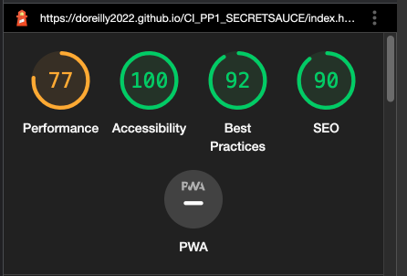
    

    

Resources

    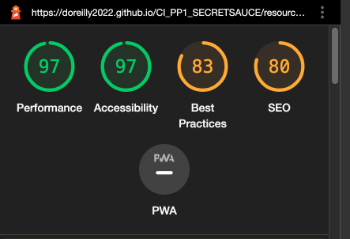
    

    

SS-Live

    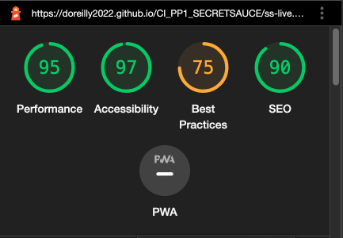
    

    

Book a Call

    
    

 
### Performing tests on various devices
 The website was tested on the following devices
- Macbook Pro 
- Dell Inspiron 
- Google pixel 6
        
### Browser compatability
 Ran the website on the following browsers to test:
- Google Chrome
- Firefox
- Microsoft Edge
        
### Testing user stories
### First Time users 
1. First time users should clearly be able to book a call from all pages. 
Feature: The CTA on every page helps users clearly find the page to book a call and guides them there. 
Status:Working with no problem. 

Screenshots

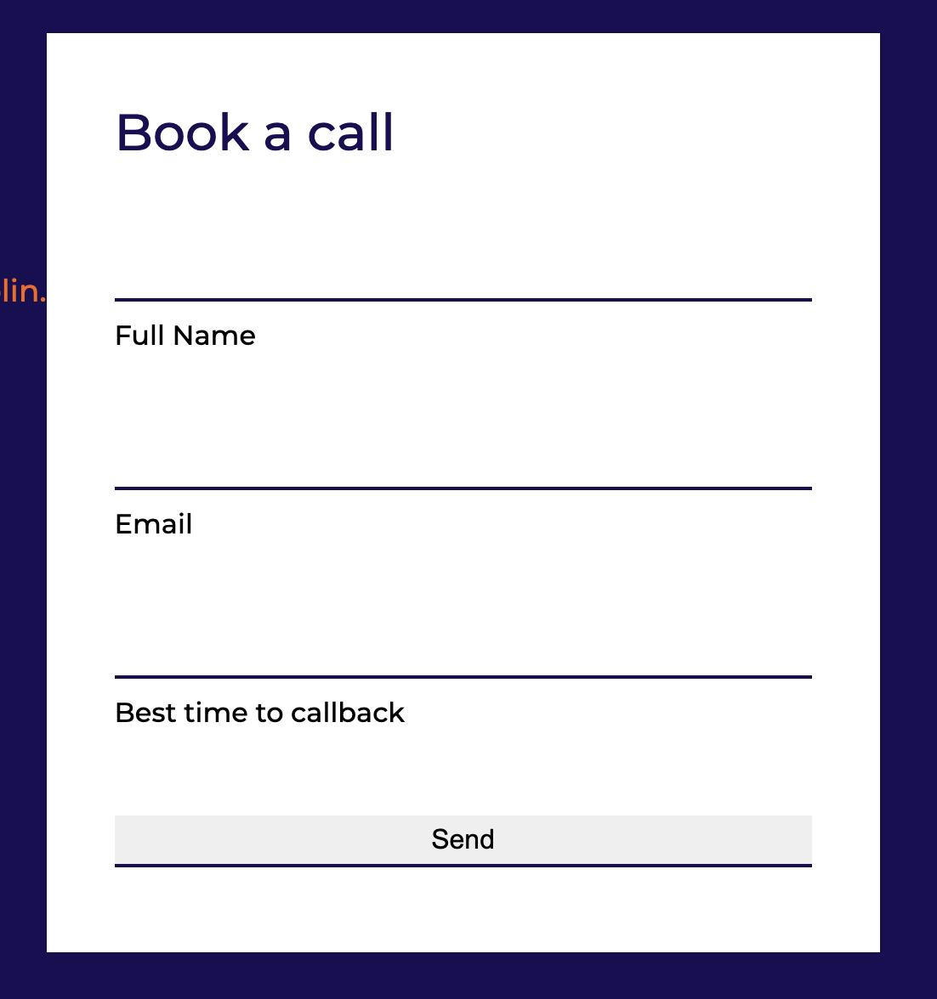
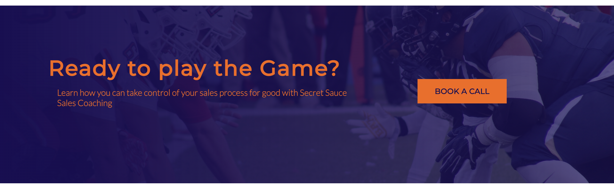

        
2. First time users should clearly be able to find resources to help their career.
Feature: The resources page is easy to find through the navigation bar at both the top and bottom of the page. The page itself is clearly laid out and responsive. 
Status:Working as expected. 

Screenshots

        
3. First time users should clearly be able to find information on the upcoming event.
Feature: The SS-Live page is easy to find through the navigation bar at both the top and bottom of the page. The page itself is clearly laid out and features info on the event as well as a CTA to book a ticket on event brite, 
Status: Working as expected. 

Screenshots

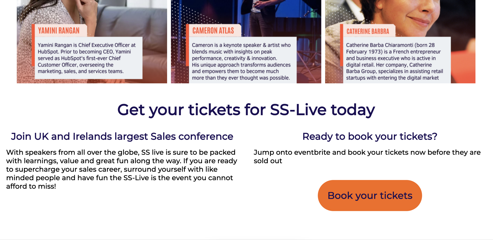

       
4. First time users should clearly be able to find the location of the offices. 
Feature: The google maps api on the contact us page will allow users to find the office easily. On desktop the address is also available in the footer. 
Status: Working as expected. 

Screenshots

        
### Returning User 
1. Returning users should clearly be able to book a call from all pages. 
Feature: As with the first time users, The CTA on every page helps users clearly find the page to book a call and guides them there. 
Status:Working with no problem. 

Screenshots

        
2. Returning users should clearly be able to find the resources page. 
Feature: As with the first time users, The resources page is easy to find through the navigation bar at both the top and bottom of the page. The page itself is clearly laid out and responsive. 
Status:Working as expected. 

Screenshots

3. Returning users should clearly be able to find information on the upcoming event.
Feature: As with the first time users, The SS-Live page is easy to find through the navigation bar at both the top and bottom of the page. The page itself is clearly laid out and features info on the event as well as a CTA to book a ticket on event brite, 
Status: Working as expected. 

Screenshots

    
### Site Owner

1. The site owner wants users to be able to book a call asap. 
Feature: CTA's are covered in first time and returning users notes above. 
Status: Working as expected.     
2.  The site owner wants to be able to push users to the event booking page. 
Feature: SS-Live page is covered in first time and returning users notes above. 
Status: Working as expected.  
        

## Bugs
-Bug: Button on CTA was not clear for booking a call. 
 fix: Update text on all pages. 
-Bug: Text ran over form on contact page. 
 fix: Add padding right on container section. 
-Bug: Resources page blog menu is not filtering. 
 fix: No fix yet. 
        
## Deployment 
The website is deployed on GitHub Pages. To do so I followed the following steps:
- In Github repo, navigate to the settings menu link on the upper right area of the screen. 
- In the lefthand menu, navigate to pages. 
- Set the source to select Branch Master.
- The page will then be published and a link is provided. 
        
## Credits
Any images I have not mentioned below were made by the developer using Canva
### Media 
In order of appearance:
-[Jonah Hill](assets/images/donnie_asoff_dialing_and_selling.png): Image by <a href="https://tr.pinterest.com/LloydInc/filmology/">FilmOlogy</a>
-[Leonardo DiCaprio](assets/images/jordan_belfort_on_phone_selling.png): Image by < a href="https://cdn.thegentlemansjournal.com/wp-content/uploads/2018/01/call-1-900x600-c-center.jpg"> Gentlemans Journal </a>
-[Matthew McConaughey](assets/images/mark_hanna_closing_sales.png): Image by <a href="https://getwallpapers.com/wallpaper/full/2/9/7/1081925-amazing-wallstreet-wallpaper-3072x2048.jpg"> Wallstreet Wallpaper </a>
-[Gary Vee](assets/images/gary_vee_profile_card.png): Image by <a href="https://encrypted-tbn0.gstatic.com/images?q=tbn:ANd9GcSpzCm2LElLbDKZpCg3wiB_qGRzIQZwH9U9NQ&usqp=CAU"> Forbes </a>
-[Grant Cardone](assets/images/grant_cardone_profile_card.png): Image by <a href="https://encrypted-tbn0.gstatic.com/images?q=tbn:ANd9GcRrafZyn7WcMav8N3UKftsArSCAVPo_ImM8bw&usqp=CAU"> Globe Newswire </a>
-[Tony Robbins](assets/images/tony_robbins.png): Image by <a href="https://encrypted-tbn0.gstatic.com/images?q=tbn:ANd9GcQiQudms5y03vXJ11xvmKD3ei9sCpeglffEkw&usqp=CAU"> Business Insider </a>
-[Yamini Rangan](assets/images/yamini_rangan_profile_card.png): Image by <a href="https://voodoointernetmarketing.com/wp-content/uploads/2021/09/YaminiRangan.jpg"> Voodoo Marketing </a>
-[Cameron Atlas](assets/images/cameron_atlas_profile_card.png): Image by <a href="https://cameronatlas.com/wp-content/uploads/2022/01/cameronatlas_speakingpage_generateconference_1-min-scaled-e1641091756512.jpg"> Cameron Atlas </a>
-[Catherine Barbra](assets/images/catherine_barbra_profile_card.png): Image by <a href="https://www.ictspring.com/site/assets/files/10163/c_barba_300x300.jpg"> ICT Spring </a>
    
    
### Code
In order of appearance:
- For the individual sections I watched extra tutorials on Flexbox from Kevin Powell : [ Kevin Powell on Flexbox
](https://www.youtube.com/kepowob) 
- I got extra infomation on flexbox from w3 schools : [ W3 schools ](https://www.w3schools.com/css/css3_flexbox.asp)
- For the blog section I watched a tutorial from Daily Tuition which explained using JQuery to me. [Daily Tuition](https://www.youtube.com/watch?v=PK_mQwVJxkQ)
- For infomation on Iframes I read a blog from HubSpot: [ HubSpot ](https://blog.hubspot.com/website/what-is-an-iframe)
- For informaion on the 404 page I used Git Hub Docs: [Github Docs](https://docs.github.com/en/pages/getting-started-with-github-pages/creating-a-custom-404-page-for-your-github-pages-site)
        
        
### Achknowledgements
I would like to mention my mentor Mo Shami for his help and support on this project. His feedback has been critical for me to get the project to where it is. His attitude towards problem solving was inspiring and his relaxed attitude helped me finish this out. 
        

            

